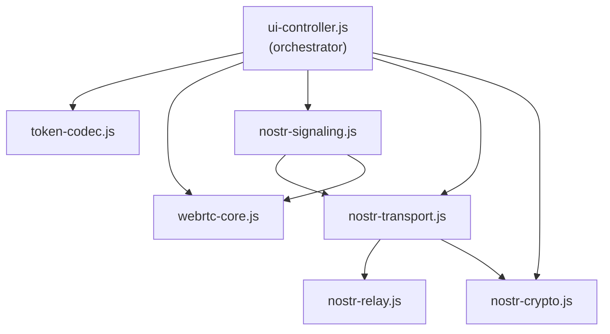

# P2P Connect — System Design

> **Last updated:** 2026-03-27

This document details every module, its internal functions, data structures, and inter-module protocols. Keep it updated when changing any module.

---

## Module Dependency Graph



---

## 1. `webrtc-core.js` — PeerSession

**Pattern:** Factory function (`PeerSession.create(config)`) returning a session object.

### DataChannels

| Channel | Label | Purpose | Mode |
|---|---|---|---|
| `dcSig` | `p2p-sig` | In-band signaling for renegotiation | JSON messages |
| `dcChat` | `p2p-chat` | Text chat | Ordered, reliable |
| `dcFiles` | `p2p-files` | File transfer | Binary (arraybuffer), ordered |

### Public API

| Function | Description |
|---|---|
| `createOffer()` | Creates 3 DataChannels + SDP offer. Sets `isPolite = false` (creator = impolite peer) |
| `acceptOffer(sdp)` | Sets remote offer, creates answer. Sets `isPolite = true` (joiner = polite peer) |
| `acceptAnswer(sdp)` | Sets remote answer. Handles edge case of already-stable signaling state |
| `addIceCandidates(candidates[])` | Adds remote ICE candidates with per-candidate error handling |
| `send(msg)` | Send text via `dcChat` |
| `sendFile(file)` | Chunked file transfer via `dcFiles` (16KB chunks, backpressure at 16MB buffer) |
| `addLocalStream(stream)` | Add/replace audio+video tracks. Uses `replaceTrack()` to avoid renegotiation |
| `removeMedia()` | Stop all local tracks, remove senders |
| `toggleAudio()` / `toggleVideo()` | Enable/disable tracks without renegotiation |
| `startScreenShare()` | Replace video track with screen capture, auto-restore on stop |
| `stopScreenShare()` | Stop screen share, restore camera track |
| `close()` | Tear down connection, channels, media |

### Renegotiation (Perfect Negotiation Pattern)

After initial connection, media changes trigger `onnegotiationneeded`. The app uses the **perfect negotiation pattern** via the `p2p-sig` DataChannel:

```
onnegotiationneeded → create offer → send via dcSig
                                          ↓
                      remote: setRemoteDescription → create answer → send via dcSig
                                                                          ↓
                                    local: setRemoteDescription (answer accepted)
```

Collision handling: impolite peer (creator) ignores colliding offers; polite peer (joiner) rolls back.

### File Transfer Protocol

```
Sender                          Receiver
──────                          ────────
{ _fileStart: true,             → incomingFileMeta = meta
  name, size, type }               incomingFileChunks = []

ArrayBuffer (16KB chunk)  ×N    → push to incomingFileChunks
                                  update progress (onFileProgress)

{ _fileEnd: true }              → Blob from chunks
                                  onFileReceived(blob, filename)
```

---

## 2. `nostr-crypto.js` — NostrCrypto

**Pattern:** Singleton IIFE.

**Dependencies:** `nostr-tools@2.10.4` loaded dynamically from esm.sh CDN.

| Function | Description |
|---|---|
| `generateKeypair()` | secp256k1 keypair → `{ privateKey: hex, publicKey: hex }` |
| `loadOrCreateIdentity()` | Load from `localStorage` or generate + persist. Keys: `nostr-privkey`, `nostr-pubkey` |
| `regenerateIdentity()` | Replace keypair in localStorage |
| `getPublicKey(privHex)` | Derive pubkey from private key |
| `encrypt(plaintext, senderPriv, receiverPub)` | NIP-44 v2 encrypt (XChaCha20-Poly1305) |
| `decrypt(ciphertext, receiverPriv, senderPub)` | NIP-44 v2 decrypt |
| `createSignedEvent(content, kind, tags, privHex)` | Build + sign Nostr event (SHA256 id, Schnorr sig) |
| `verifyEvent(event)` | Verify Nostr event signature |
| `truncatePubkey(hex)` | Display helper: `first8…last8` |
| `preload()` | Pre-load CDN library for instant subsequent calls |

---

## 3. `nostr-relay.js` — NostrRelay

**Pattern:** Class (`new NostrRelay(url, opts)`)

Manages a single WebSocket connection to one Nostr relay.

### States (`RelayState`)

```
DISCONNECTED ──▶ CONNECTING ──▶ CONNECTED
     ▲                              │
     └──────── onclose / error ─────┘
               (auto-reconnect)
```

### Key Behaviors

| Behavior | Detail |
|---|---|
| **Auto-reconnect** | Exponential backoff: 1s → 1.5× → max 30s. Resets on successful connect |
| **Resubscribe** | All active subscriptions re-sent on reconnect |
| **Publish timeout** | 5s — if no `OK` response, rejects as failure |
| **Rate-limit detection** | `OK` with reason containing "rate" sets `err.isRateLimit = true` |
| **Subscription IDs** | Format: `sub-{counter}-{timestamp}` |

### Protocol Messages

| Direction | Message | Handling |
|---|---|---|
| **Send** | `["EVENT", event]` | Publish signed event |
| **Send** | `["REQ", subId, ...filters]` | Subscribe with filters |
| **Send** | `["CLOSE", subId]` | Unsubscribe |
| **Receive** | `["EVENT", subId, event]` | Route to subscription callback |
| **Receive** | `["OK", eventId, success, reason]` | Resolve/reject pending publish |
| **Receive** | `["EOSE"]` | End of stored events (no-op) |
| **Receive** | `["NOTICE", message]` | Log as warning |

---

## 4. `nostr-transport.js` — NostrTransport

**Pattern:** Singleton IIFE.

Orchestrates **multiple relay connections**, routes encrypted signaling messages, handles deduplication.

### Constants

| Constant | Value | Purpose |
|---|---|---|
| `EVENT_KIND` | `24133` | Nostr event kind for WebRTC signaling |
| `MAX_PROCESSED_EVENTS` | `500` | Dedup set cap (prunes oldest 100 when exceeded) |
| `ICE_STALE_SECONDS` | `60` | Drop ICE candidates older than 60s |
| `MAX_ICE_PER_SESSION` | `20` | Max ICE events per session (rate limit) |
| `DEFAULT_RELAYS` | 3 URLs | `relay.primal.net`, `nos.lol`, `offchain.pub` |

### Storage Keys

| Key | Data |
|---|---|
| `nostr-relays` | `string[]` — user-configured relay URLs |

### Public API

| Function | Description |
|---|---|
| `init(privateKey, publicKey, opts)` | Set identity + callbacks |
| `connect()` | Connect to all configured relays in parallel |
| `disconnect()` | Disconnect all, clear state |
| `sendSignal(toPubKey, message)` | Encrypt + sign + publish to all relays (with retry) |
| `subscribeSignals(handler)` | Subscribe to inbound events tagged to our pubkey |
| `addRelay(url)` / `removeRelay(url)` | Dynamic relay management (hot-add when connected) |
| `resetRelays()` | Restore default relay list |
| `getRelayStates()` | Array of `{url, state}` for UI display |

### Nostr Event Format

```json
{
  "kind": 24133,
  "tags": [["p", "<receiverPubKey>"], ["t", "webrtc"], ["v", "1"]],
  "content": "<NIP-44 encrypted payload>",
  "created_at": 1711300000,
  "pubkey": "<senderPubKey>",
  "id": "<SHA256 hash>",
  "sig": "<Schnorr signature>"
}
```

### Encrypted Payload Schema

```json
{
  "v": 1,
  "type": "offer" | "answer" | "ice" | "close",
  "session": "<32-byte hex session ID>",
  "data": "<base64url compressed SDP+candidates>",
  "ts": 1711300000000
}
```

### Publish Failover Flow

```
_publishWithRetry(event):
  Attempt 1: publish to ALL connected relays in parallel
    ├─ If any relay ACKs (OK true) → success (Promise.any)
    └─ If ALL reject → wait 2s, retry

  Attempt 2: publish to ALL connected relays again
    ├─ If any accepts → success
    └─ If all reject → throw Error("All relays rejected")
```

### Inbound Event Processing Pipeline

```
Raw WebSocket message
  → JSON parse
  → Deduplication (skip if event.id seen before)
  → Signature verification (NostrCrypto.verifyEvent)
  → NIP-44 decryption (NostrCrypto.decrypt)
  → Payload JSON parse
  → Version check (v === 1)
  → Type validation (offer/answer/ice/close)
  → Staleness check (ICE candidates > 60s old are dropped)
  → Dispatch to signal handler
```

---

## 5. `nostr-signaling.js` — NostrSignaling

**Pattern:** Singleton IIFE.

Bridges `NostrTransport` and `PeerSession` — automates the full WebRTC handshake over Nostr.

### Session State

```javascript
_sessions: Map<sessionId, {
  session: PeerSession,      // the WebRTC session
  remotePubKey: string,      // hex
  state: 'pending' | 'connecting' | 'connected' | 'closed',
  role: 'creator' | 'joiner',
  createdAt: number
}>
```

### Signal Flow

```
Creator                          Nostr Relays                    Joiner
────────                         ────────────                    ──────
startSession(remotePubKey)
  → PeerSession.createOffer()
  → wait 1.5s for ICE
  → compress(sdp + candidates)
  → NostrTransport.sendSignal
    ──── [offer] ────────────▶   ──── [offer] ────────────▶
                                                           _handleOffer()
                                                             → PeerSession.acceptOffer()
                                                             → add remote ICE
                                                             → wait 1.5s for ICE
                                                             → compress(answer + candidates)
                                 ◀── [answer] ──────────── ◀── NostrTransport.sendSignal
  _handleAnswer()
    → PeerSession.acceptAnswer()
    → add remote ICE

     ──── ICE connectivity checks ──────
     ──── DTLS / SCTP handshake ────────
     ──── DataChannels open ────────────
```

### ICE Candidate Batching

Individual ICE candidates are **queued** and sent in batches after a 200ms debounce:

```
onIceCandidate → push to _iceBatchQueues[sessionId]
               → reset 200ms timer
               → on timer fire: compress all queued candidates
                 → NostrTransport.sendSignal(type: 'ice')
```

### Compression

Uses `pako.deflate(level: 9)` + base64url encoding for signal data (SDP + candidates). Decompression uses `pako.inflate`.

### Session Cleanup

- Timer runs every 30s
- Sessions in non-`connected` state older than 2 minutes are auto-closed

---

## 6. `token-codec.js` — TokenCodec

**Pattern:** Singleton IIFE.

### Token Format (v2)

```
P2P2-<base64url(pako.deflate(JSON.stringify(payload)))>
```

Payload:
```json
{
  "v": 2,
  "t": "offer" | "answer" | "ice",
  "ts": 1711300000000,
  "s": { "type": "offer", "sdp": "..." } | null,
  "c": ["candidate:... typ host ...", "..."]
}
```

### Functions

| Function | Description |
|---|---|
| `encode(type, sdp, candidates)` | Compress + encode. Strips non-essential ICE metadata (generation, ufrag, network-id, network-cost) to save ~40-50 chars/candidate |
| `decode(token)` | Decompress + decode. Handles both v1 (`P2P1-`, uncompressed) and v2 (`P2P2-`, compressed) formats |

---

## 7. `ui-controller.js` — UI Controller

**Pattern:** Self-executing IIFE, imports all other modules.

### Responsibilities

1. **DOM binding** — 80+ element references in `dom` object
2. **Session flow orchestration** — Create/Join/Nostr UI state machines
3. **Chat protocol** — Message IDs, delivery acknowledgments (`_ack`)
4. **Media call management** — getUserMedia, device enumeration, camera/speaker selection, resolution
5. **QR code** — generation (qrcode.js), camera scanning (jsQR + html5-qrcode), clipboard image decode
6. **Token inspector** — decode and display SDP/ICE in a modal
7. **Contact list** — CRUD in localStorage (`nostr-contacts`)
8. **Nostr initialization** — load identity, connect relays, init signaling, wire callbacks

### Chat Message Protocol

```json
// Send
{ "id": 42, "text": "Hello!" }

// Delivery ack
{ "_ack": 42 }
```

### localStorage Keys Used

| Key | Module | Data |
|---|---|---|
| `nostr-privkey` | nostr-crypto | Hex private key |
| `nostr-pubkey` | nostr-crypto | Hex public key |
| `nostr-relays` | nostr-transport | JSON array of relay URLs |
| `nostr-contacts` | ui-controller | JSON array of `{pubkey, nickname}` |
| `p2p-scanner-cam` | ui-controller | Last successful camera deviceId |

### Connection State Badge

| State | Color | Triggered By |
|---|---|---|
| `idle` | Default | Initial / after reset |
| `gathering` | Amber | ICE gathering started |
| `waiting` | Amber | ICE complete, waiting for peer |
| `connecting` | Amber | Answer accepted, ICE checking |
| `connected` | Green | ICE + DTLS successful |
| `failed` | Red | ICE/DTLS failed |
| `closed` | Gray | Session closed |

---

## 8. External Dependencies (CDN)

| Library | Version | CDN | Purpose |
|---|---|---|---|
| `nostr-tools` | 2.10.4 | esm.sh | secp256k1 keys, NIP-44 encrypt/decrypt, event signing |
| `pako` | 2.1.0 | cdnjs | zlib deflate/inflate for SDP compression |
| `qrcode` | 1.5.1 | jsdelivr | QR code image generation |
| `jsQR` | 1.4.0 | jsdelivr | Pure JS QR decoding (camera + image) |
| `html5-qrcode` | 2.3.8 | cdnjs | Camera-based QR scanning fallback |
