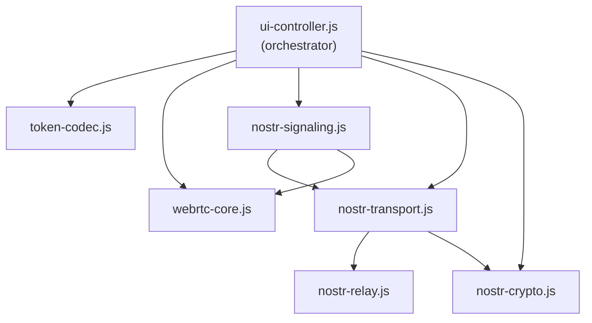

# P2P Connect — Architecture

> **Last updated:** 2026-07-19

## 1. Overview

P2P Connect is a **serverless WebRTC communication app** that runs entirely in the browser. It enables two peers to establish encrypted peer-to-peer connections for real-time **chat**, **file transfer**, and **audio/video calls** — with no backend server ever touching the data.

The application embraces a zero-infrastructure design philosophy for its core data path. After the initial signaling phase, all communication happens directly between the peers' browsers, offering robust privacy and reducing operational overhead.

## 2. Architecture Diagram

```text
┌─────────────────────────────────────────────────────────────────────────┐
│                          Browser (Peer A)                                │
│                                                                         │
│  ┌──────────────┐   ┌──────────────┐   ┌─────────────────────────────┐ │
│  │ UI Controller │──▶│ Token Codec  │   │     WebRTC Core             │ │
│  │  (DOM, flows, │   │              │   │  ┌──────────────────────┐  │ │
│  │   chat, media)│   │  Encode/     │   │  │ RTCPeerConnection    │  │ │
│  │              │──▶│  Decode      │   │  │  ├─ DataChannels ×3   │  │ │
│  │              │   │  (pako+b64)  │   │  │  │   sig / chat / file│  │ │
│  │              │   └──────────────┘   │  │  ├─ ICE Agent         │  │ │
│  │              │                      │  │  ├─ Media Tracks      │  │ │
│  │              │──▶┌──────────────┐   │  │  └─ DTLS/SRTP/SCTP   │  │ │
│  │              │   │ Nostr Stack  │   │  └──────────────────────┘  │ │
│  │              │   │  ┌─ Crypto   │   │                            │ │
│  │              │   │  ├─ Relay    │   └─────────────────────────────┘ │
│  │              │   │  ├─ Transport│                                   │
│  │              │   │  └─ Signaling│                                   │
│  └──────────────┘   └──────────────┘                                   │
└─────────────────────────────────────────────────────────────────────────┘
         │                    │                           │
         │ Manual tokens      │ Nostr relays              │ Direct P2P
         │ (copy-paste/QR)    │ (encrypted signaling)     │ (encrypted data)
         ▼                    ▼                           ▼
┌─────────────────────────────────────────────────────────────────────────┐
│                          Browser (Peer B)                                │
│                     (identical code, mirror role)                        │
└─────────────────────────────────────────────────────────────────────────┘
```

## 3. Module Map

| File | Lines | Role |
|---|---|---|
| `index.html` | 470 | Page structure, all UI panels and modals |
| `style.css` | ~1400 | Full design system — dark theme, responsive layout |
| `ui-controller.js` | 1715 | **Orchestrator** — DOM wiring, all user flows, Nostr init |
| `webrtc-core.js` | 696 | PeerSession factory — connection lifecycle, media, files |
| `nostr-signaling.js` | 522 | Bridge: Nostr transport ↔ WebRTC PeerSession |
| `nostr-transport.js` | 541 | Multi-relay orchestrator, publish/subscribe, deduplication |
| `nostr-relay.js` | 282 | Single relay WebSocket manager, reconnection |
| `nostr-crypto.js` | 193 | Key management, NIP-44 encrypt/decrypt, event signing |
| `token-codec.js` | 169 | Encode/decode compressed signaling tokens |
| `chat-store.js` | 190 | Persistent chat storage using localStorage |

## 4. Connection Modes

### Mode 1: Manual Token Exchange

- **Peer A** creates a session → app generates an **offer token** (SDP + ICE candidates, compressed, base64url-encoded, using v2 `P2P2-` format with pako compression)
- Token is shared via **any messenger** (WhatsApp, email, SMS) or **QR code**
- **Peer B** pastes/scans the token → app generates an **answer token**
- Answer is sent back to Peer A → connection established
- **Pros:** Zero infrastructure, works offline (for the token exchange)
- **Cons:** Two manual copy-paste steps, both peers must be online simultaneously

```text
Peer A (Creator)                         Peer B (Joiner)
─────────────────                        ────────────────
1. Click "Create Session"
2. createOffer() → SDP
3. Wait ~3s for ICE candidates
4. Encode offer + ICE → token
5. Copy token ──── (WhatsApp/email) ───▶ 6. Paste token
                                         7. setRemoteDescription(offer)
                                         8. addIceCandidates(bundled)
                                         9. createAnswer() → SDP
                                        10. Wait ~3s for ICE candidates
                                        11. Encode answer + ICE → token
12. Paste token ◀── (WhatsApp/email) ── 13. Copy token
14. setRemoteDescription(answer)
15. addIceCandidates(bundled)

    ────── ICE connectivity checks ──────
    ────── DTLS handshake ───────────────
    ────── SCTP association ─────────────
    ────── DataChannel open ─────────────

16. Chat ready                          16. Chat ready
```

### Mode 2: Nostr Auto-Signaling (Recommended)

- Both peers have an auto-generated **Nostr keypair** (stored in localStorage)
- Peer A enters Peer B's **public key** and clicks Connect
- The app sends an **NIP-44 encrypted offer** through Nostr relay servers
- Peer B's app automatically **detects the offer**, generates an answer, and sends it back
- Connection established with **zero manual steps** (after initial key exchange)
- **Pros:** One-click connect, supports saved contacts, reusable identity
- **Cons:** Requires Nostr relay servers to be reachable

## 5. Security Model

### What's Encrypted

| Layer | Protects | Protocol |
|---|---|---|
| **DTLS 1.2+** | DataChannel traffic | TLS over UDP |
| **SRTP** | Audio/video media | AES-128-CTR |
| **NIP-44** | Nostr signaling messages | XChaCha20-Poly1305 (with HKDF key derivation) |

### Key Properties

- **No server sees data** — all communication is peer-to-peer after connection setup
- **No data persistence** — refreshing the page destroys all state (keys persist in localStorage)
- **End-to-end encrypted signaling** — even Nostr relay operators cannot read signaling payloads
- **TURN relay is transparent** — if used, TURN sees only encrypted DTLS packets

### Risks & Mitigations

| Risk | Mitigation |
|---|---|
| MITM during token exchange | Use an E2EE messenger for token/key sharing |
| Token replay | Timestamps + ICE candidate expiry make stale tokens fail naturally |
| No peer identity verification | Trust the out-of-band channel; verify pubkeys directly |
| Nostr relay logging | Event content is NIP-44 encrypted; relays see only pubkeys + metadata |

## 6. NAT Traversal & TURN

STUN enables peers to discover their public IP:port mappings, but it only works when at least one side has a permissive NAT type.

| Scenario | STUN works? | TURN required? |
|---|---|---|
| Both peers on open networks | ✅ | No |
| One peer behind symmetric NAT | ❌ often | Yes |
| Both peers behind symmetric NAT | ❌ | Yes |
| Corporate firewall blocking UDP | ❌ | Yes (TCP/TLS TURN) |
| Carrier-grade NAT (mobile 4G/5G) | ❌ sometimes | Often yes |

TURN relays traffic through an intermediary server. The data is still DTLS-encrypted end-to-end — the TURN server cannot read message contents.

In production, approximately 10-15% of WebRTC connections require TURN relay.

## 7. Design Decisions & Trade-offs

1. **Two manual exchanges required** — Nostr Auto-Signaling eliminates this for users who share pubkeys.
2. **No presence / discovery** — Nostr pubkeys + contact list now provide basic presence.
3. **ICE candidate timing** — the app waits ~3 seconds to bundle candidates, but on slow networks some candidates may arrive later. The ICE Exchange section handles this, but adds friction.
4. **Session resumption** — if the connection drops, both peers must repeat the full token exchange. There's no session persistence or renegotiation shortcut.
5. **Token size** — offer tokens can be 2-5 KB (base64). This fits in most messengers but may be unwieldy for SMS.
6. **NAT traversal without TURN** — roughly 10-15% of real-world connections will fail without a TURN server.
7. **No push notifications** — the app must be open in both browsers simultaneously during connection setup.

## 8. Module Dependency Graph



## 9. Technology Stack

| Component | Technology |
|---|---|
| **Runtime** | Browser (vanilla JS, ES modules) |
| **WebRTC** | Native `RTCPeerConnection` API |
| **Cryptography** | `nostr-tools` via esm.sh CDN (secp256k1, NIP-44) |
| **Compression** | pako (zlib deflate, loaded via CDN) |
| **QR Codes** | qrcode.js (generation), jsQR + html5-qrcode (scanning) |
| **Styling** | Vanilla CSS, dark theme, fully responsive |
| **Dev Server** | `npx serve` (local HTTPS with certs) |
| **No build step** | Runs directly from source files |

## 10. External Dependencies

| Library | Version | CDN | Purpose |
|---|---|---|---|
| `nostr-tools` | 2.10.4 | esm.sh | secp256k1 keys, NIP-44 encrypt/decrypt, event signing |
| `pako` | 2.1.0 | cdnjs | zlib deflate/inflate for SDP compression |
| `qrcode` | 1.5.1 | jsdelivr | QR code image generation |
| `jsQR` | 1.4.0 | jsdelivr | Pure JS QR decoding (camera + image) |
| `html5-qrcode` | 2.3.8 | cdnjs | Camera-based QR scanning fallback |
